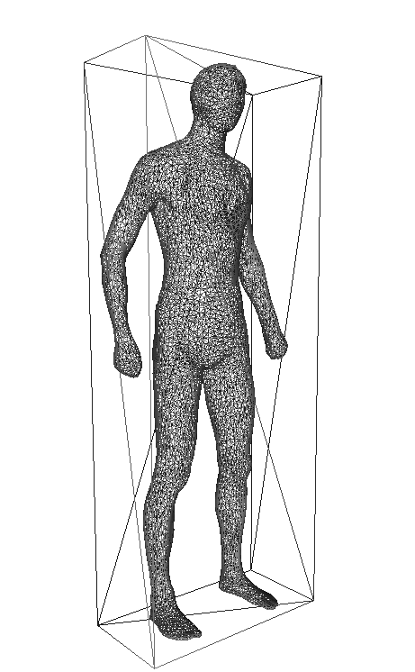

## 获得任意流形网格的OBB包围盒

原理和解释:[https://lljstar.com/2018/08/13/OBB/](https://lljstar.com/2018/08/13/OBB/)

### 依赖和文件系统

1. `include`:头文件
2. `lib`:库文件
3. `oboundingbox.cpp` 源文件

4. 两个外部头文件，一些定义和公共函数   
`CGAuxFunc/globaldefinition.h`  
`CGAuxFunc/auxiliary.h`  
地址：[https://github.com/LingjieLi/CGAuxFunc](https://github.com/LingjieLi/CGAuxFunc)
5. 依赖的第三方库
   矩阵库Eigen  
  [Eigen](http://eigen.tuxfamily.org/index.php?title=Main_Page)  

### 存在问题  
包围盒三个边长`L` `H` `W` 不是按照预期的最长、次长、最短

### 效果图
```
L: 0.681557  W: 0.329391  H: 1.77897
C: 1.56036e-08 , -2.49096e-08 , 3.97149e-08
```

